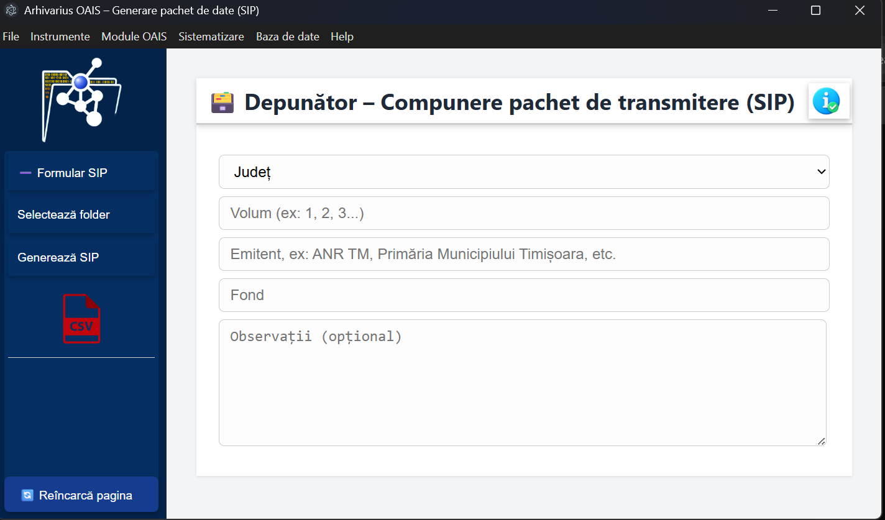
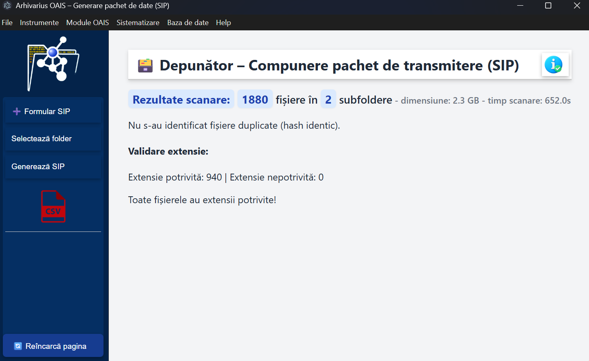

# Arhivarius SIP – Prezentare

Arhivarius SIP este un modul dedicat compunerii pachetului de transmitere (SIP), conform cerințelor OAIS.  
Aplicația permite validarea fișierelor, generarea manifestelor și crearea pachetului ZIP final pentru transfer.

---
## Demonstrație vizuală: Fluxul de generare SIP

---
## Funcționare (pe scurt)

### 1. Formular SIP
Completezi câmpurile obligatorii: județ, volum, creator de arhivă, fond.  
Opțional poți adăuga observații.

### 2. Selectează folder
Alegi folderul cu fișierele pentru SIP.  
Aplicația scanează și identifică automat:
- fișiere virusate (se șterg automat în ~60s);
- fișiere dublete (poți alege: ștergere, mutare la coș, mutare în alt folder, creare fișier martor);
- fișiere cu extensie modificată (poți corecta extensia instant).

### 3. Generează SIP
Aplicația execută automat 6 pași sincronizați:
- validare formular;
- calcul hash SHA‑256 pentru fiecare fișier;
- creare ZIP + manifest intern;
- calcul hash SHA‑256 pentru ZIP;
- creare manifest extern (include hash ZIP);
- afișarea informațiilor despre ZIP, manifeste și sincronizare.

### 4. Raport de transfer
Poți descărca fișierul CSV cu detalii despre conținutul SIP.

---

## Capturi de ecran

### Formular SIP

### Scanare și progres

### Rezultate scanare

### Pachet generat

---

## Tehnologii implicate (în fundal)
Aplicația utilizează instrumente specializate pentru analiză și validare:
- **ExifTool** – extragere metadate;
- **Siegfried + baza PRONOM** – identificare tipuri de fișiere;
- **veraPDF** – validare PDF/A;
- alte utilitare interne pentru hashing, structurare și verificări.

---
## Arhitectura aplicației

Arhivarius SIP este construit ca aplicație desktop pe baza framework‑ului **Electron**, combinând:

- un **proces principal (main process)** pentru operațiuni de sistem, execuția utilitarelor externe, generarea SIP și gestionarea bazei de date;
- un **proces de interfață (renderer process)** pentru logica UI și interacțiunea cu utilizatorul;
- un strat **Node.js** care asigură acces la sistemul de fișiere, hashing, procese externe și module interne.

Arhitectura este modulară, cu separarea clară a responsabilităților: scanare, validare, generare SIP, baze de date, utilitare externe și interfață.

---

### Rolul Node.js în aplicație

Node.js este utilizat ca strat de execuție pentru operațiuni care necesită acces direct la sistemul de operare:

- manipularea fișierelor și directoarelor (`fs`, `path`);
- calcul hash SHA‑256 (`crypto`);
- execuția utilitarelor externe (ExifTool, Siegfried, veraPDF) prin `child_process`;
- generarea arhivelor ZIP (JSZip, AdmZip);
- gestionarea bazei de date SQLite;
- comunicarea IPC între procesele Electron.

Node.js permite aplicației să combine o interfață web cu funcționalități locale avansate, specifice aplicațiilor native.

---

### Componente principale

#### 1. Procesul principal (Electron + Node.js)
Responsabil pentru:
- inițializarea aplicației și crearea ferestrei principale;
- gestionarea dialogurilor de fișiere;
- scanarea și analiza fișierelor;
- execuția utilitarelor externe (Siegfried, ExifTool, veraPDF);
- generarea manifestelor MI/ME și a arhivei ZIP;
- gestionarea bazei de date SQLite;
- comunicarea IPC cu interfața.

Module utilizate:
- `electron`, `fs`, `path`, `child_process`
- `sqlite3` (bază de date)
- `adm-zip` și `JSZip` (arhivare)
- `crypto` (hashing)
- `unzipper`, `https`, `os`

#### 2. Procesul de interfață (renderer)
Responsabil pentru:
- afișarea formularului SIP;
- afișarea progresului de scanare;
- gestionarea listei de fișiere, duplicate, extensii modificate;
- generarea hărții vizuale a structurii folderelor;
- trimiterea comenzilor către procesul principal prin IPC.

Module utilizate:
- `ipcRenderer`
- utilitare locale (`emitent.js`, funcții de scanare și mapare)

---

## Baza de date

Aplicația folosește o bază de date **SQLite**, stocată local în directorul utilizatorului:

Baza de date este utilizată pentru:
- evidența pachetelor generate;
- logarea operațiunilor;
- păstrarea metadatelor asociate fiecărui SIP.

---

## Construcția manifestelor (MI-SIP și ME-SIP)

Generarea pachetului SIP respectă principiile OAIS privind integritatea, verificabilitatea și trasabilitatea informației.  
Procesul produce două manifeste sincronizate:

- **Manifest Intern (MI-SIP)** – inclus în ZIP, descrie conținutul pachetului.
- **Manifest Extern (ME-SIP)** – livrat separat, permite verificarea pachetului fără a-l deschide.

Ambele manifeste sunt legate printr-un **hash sincronizat**, iar ME conține suplimentar hash-ul fizic al ZIP-ului final.

---

## Flux OAIS (rezumat)

1. **Identificarea și colectarea fișierelor**  
   Sistemul scanează folderul selectat, identifică fișierele valide și calculează hash SHA‑256 pentru fiecare.

2. **Construirea MI-SIP (faza preliminară)**  
   Se generează structura manifestului intern, cu hash-urile individuale ale fișierelor și un câmp placeholder pentru hash-ul pachetului.

3. **Construirea ZIP-ului provizoriu**  
   ZIP-ul este generat cu toate fișierele + MI-SIP provizoriu.

4. **Calculul hash-ului sincronizat**  
   Se calculează hash-ul ZIP-ului provizoriu. Acesta devine „ancora” comună MI ↔ ME.

5. **Actualizarea MI-SIP**  
   Hash-ul sincronizat este injectat în MI-SIP, iar MI este rescris în ZIP.

6. **Generarea ZIP-ului final**  
   ZIP-ul este reconstruit cu MI actualizat. Se calculează hash-ul fizic al ZIP-ului final.

7. **Construirea ME-SIP**  
   Manifestul extern include:
   - hash-ul sincronizat (identic cu MI),
   - hash-ul fizic al ZIP-ului final,
   - structura completă a pachetului,
   - metadate OAIS (sursă, dată, algoritm).

8. **Verificare încrucișată**  
   Orice modificare a ZIP-ului, MI sau ME produce inconsistențe detectabile imediat.

## Schema fluxului MI → ZIP → ME

Procesul de generare și verificare a pachetului SIP poate fi reprezentat astfel:

                 ┌──────────────────────────┐
                 │  Scanare fișiere sursă   │
                 │  + hash individual (SHA) │
                 └─────────────┬────────────┘
                               │
                               ▼
                 ┌─────────────────────────────┐
                 │   Construire MI-SIP         │
                 │  (hash_pachet = placeholder)│
                 └─────────────┬───────────────┘
                               │
                               ▼
                 ┌─────────────────────────────┐
                 │   ZIP provizoriu            │
                 │  (fișiere + MI preliminar)  │
                 └─────────────┬───────────────┘
                               │
                               ▼
                 ┌──────────────────────────┐
                 │  Calcul hash sincronizat │
                 │  SHA256(ZIP provizoriu)  │
                 └─────────────┬────────────┘
                               │
                               ▼
                 ┌──────────────────────────┐
                 │  Actualizare MI-SIP      │
                 │  (hash_pachet = ancora)  │
                 └─────────────┬────────────┘
                               │
                               ▼
                 ┌──────────────────────────┐
                 │   ZIP final              │
                 │  (fișiere + MI final)    │
                 └─────────────┬────────────┘
                               │
                               ▼
                 ┌──────────────────────────┐
                 │  Calcul hash ZIP final   │
                 │  (amprentă fizică)       │
                 └─────────────┬────────────┘
                               │
                               ▼
                 ┌──────────────────────────┐
                 │   Construire ME-SIP      │
                 │  (hash_pachet = ancora)  │
                 │  (hash_zip = amprentă)   │
                 └─────────────┬────────────┘
                               │
                               ▼
                 ┌──────────────────────────┐
                 │  Verificare încrucișată  │
                 │  MI ↔ ZIP ↔ ME           │
                 └──────────────────────────┘

---

### Interpretare

- **MI-SIP** descrie conținutul intern și participă la calculul hash-ului pachetului.  
- **ZIP provizoriu** permite extragerea hash-ului sincronizat (ancora).  
- **ZIP final** include MI actualizat și devine obiectul fizic de transfer.  
- **ME-SIP** descrie pachetul ca obiect OAIS și permite verificarea externă.  
- **Verificarea încrucișată** asigură detectarea oricărei modificări apărute în transport.

---
## Contribuții

Dezvoltarea aplicației a fost realizată în colaborare cu **Bogdan Florin Popovici** ([pagina personală](https://bogdanpopovici2008.wordpress.com/)), care a avut inițiativa și a definit conceptul general al fluxului. Implementarea tehnică, arhitectura și documentația au fost realizate de **danpura**.

---
## Status documentație
Documentația este în curs de extindere. Vor fi adăugate secțiuni privind:
- mecanismele de detecție a alterării în transport;
- rolul fiecărui instrument extern (ExifTool, Siegfried, veraPDF, etc);
- exemple de validare și audit.

